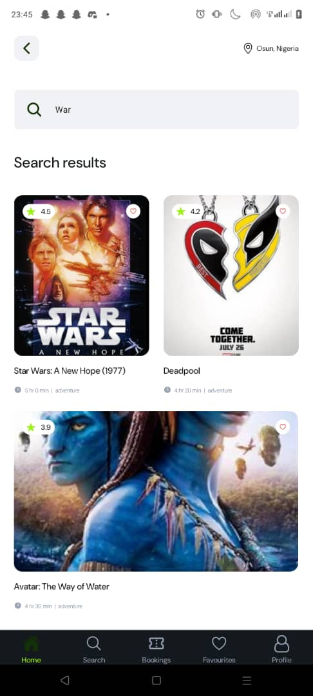

# Tikeeti

Mobile app built with React Native expo and uses react query for state management.
A search result page displaying search results based on users input

Unit tests written to show app functions as expected

## Screenshots

### Splashscreen


### Empty home & Home screen with data

&nbsp;&nbsp;&nbsp;&nbsp;&nbsp;&nbsp;&nbsp;&nbsp;

## Run locally

To install all dependencies, you need to run the following command:

```bash

git clone https://github.com/ayomidedaniel1/tikeeti.git
cd tikeeti

npm install
npm run start
npx run android

or

npx run ios

```
